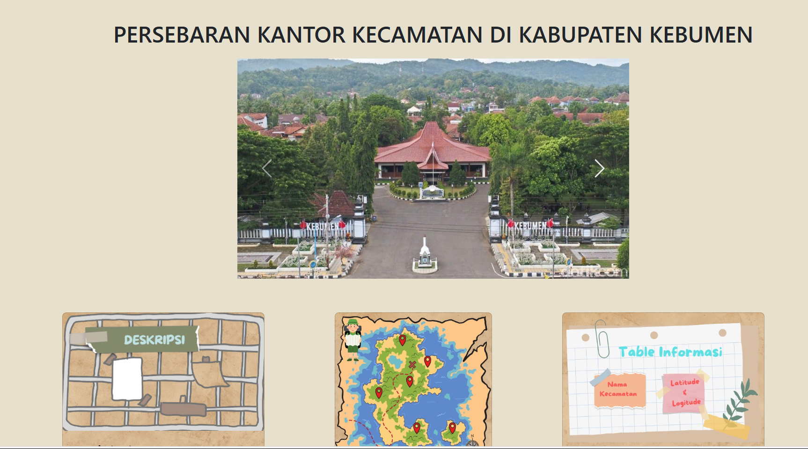
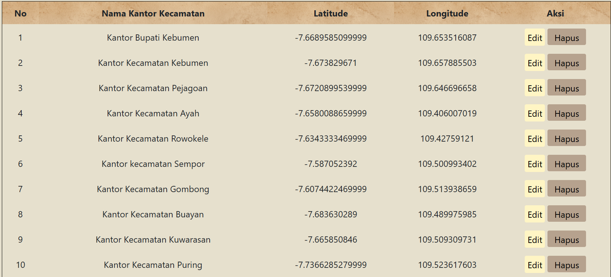
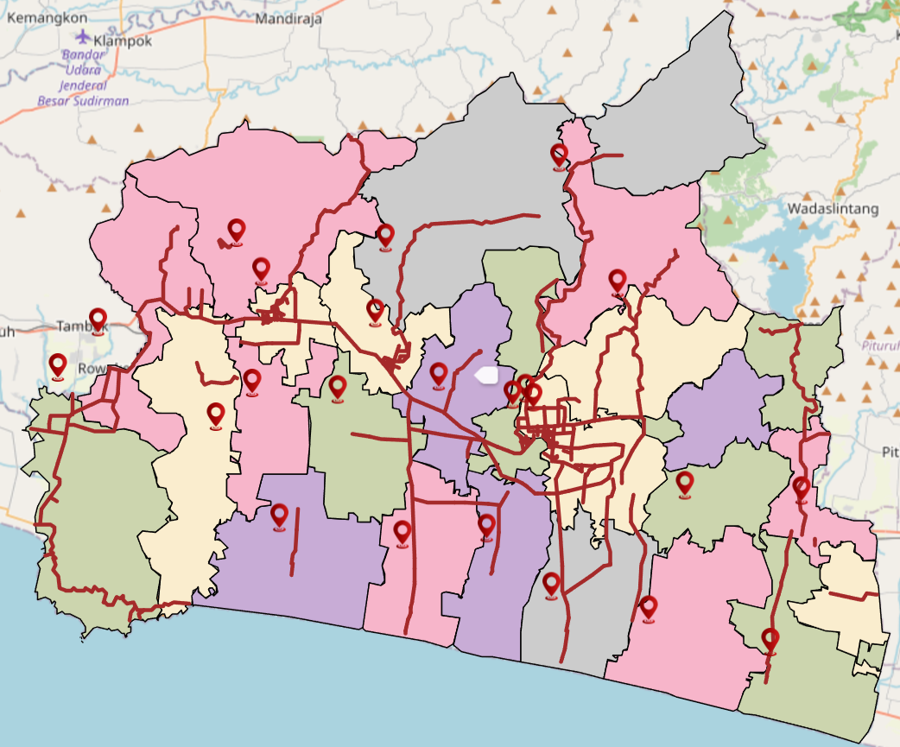
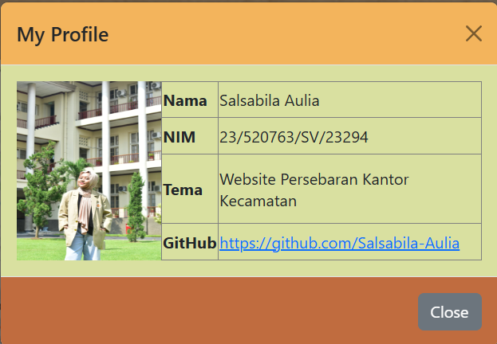

# LoKet BooM (Lokasi Kantor Kecamatan di Kebumen)
WebGIS Persebaran Kantor Kecamatan di Kabupaten Kebumen

Website GIS “LoKet BooM” merupakan website yang  berisikan titik lokasi persebaran kantor kecamatan diseluruh Kabupaten Kebumen. Web ini berisikan informasi dari nama kantor kecamatan, kode kecamatan, dan koordinat dari lokasi persebaran kantor kecmatan di kabupaten kebumen.

## Komponen Pembangun Produk
Website GIS LoKet BooM mungkin dibuat menggunakan struktur PHP dan CSS karena kombinasi keduanya sangat cocok untuk mengelola data dinamis dan menyajikan tampilan yang menarik serta responsif. PHP digunakan sebagai bahasa pemrograman server-side yang digunakan untuk pengelolaan data lokasi secara dinamis, integrasi dengan database, dan pembuatan halaman interaktif, seperti memuat peta sesuai koordinat tertentu pada  lokasi. Sementara itu, CSS digunakan untuk mengatur tata letak dan desain antarmuka sehingga tampilan website menjadi lebih estetis, responsif, dan mendukung visualisasi data GIS, seperti peta, marker, popup, dan elemen grafis lainnya. Kombinasi ini menjadikan website lebih efisien dalam pengelolaan data backend sekaligus memastikan pengalaman pengguna yang baik melalui tampilan frontend yang menarik.

## Sumber Data
Data Lokasi Kantor Kecamatan di Kabupaten Kebumen diambil dari https://kebumenkab.bps.go.id/id/idhttps:/kebumenkab.bps.go.id/id.

## Tangkapan Layar Komponen Penting Produk

### Landing Page.

### Elemen Database.

### Peta Digital

## Profile Pembuat

